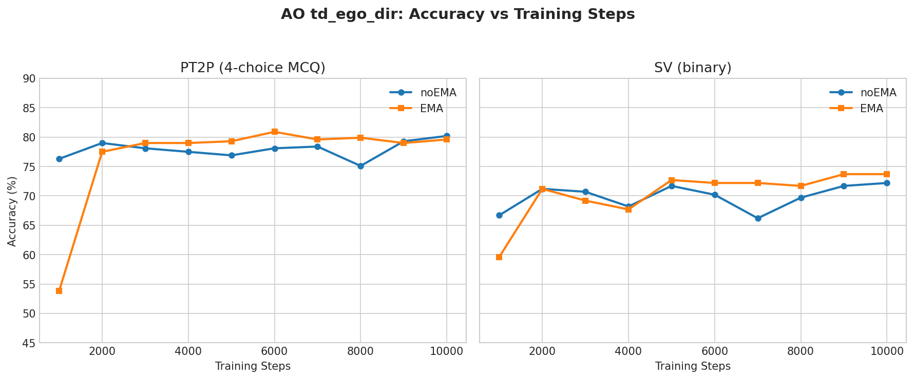
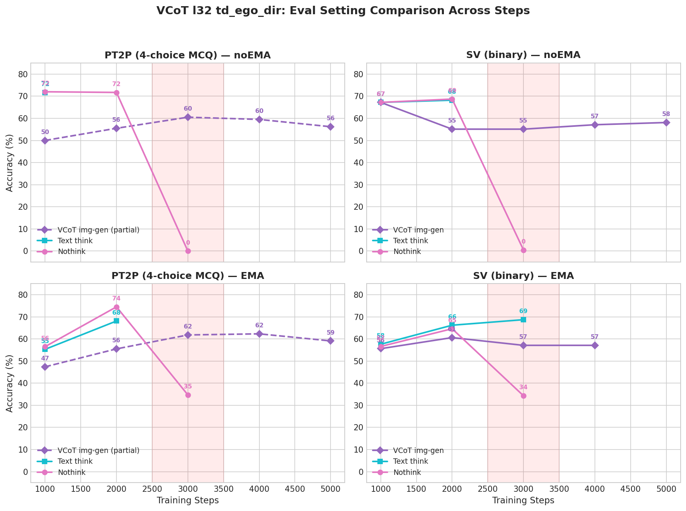
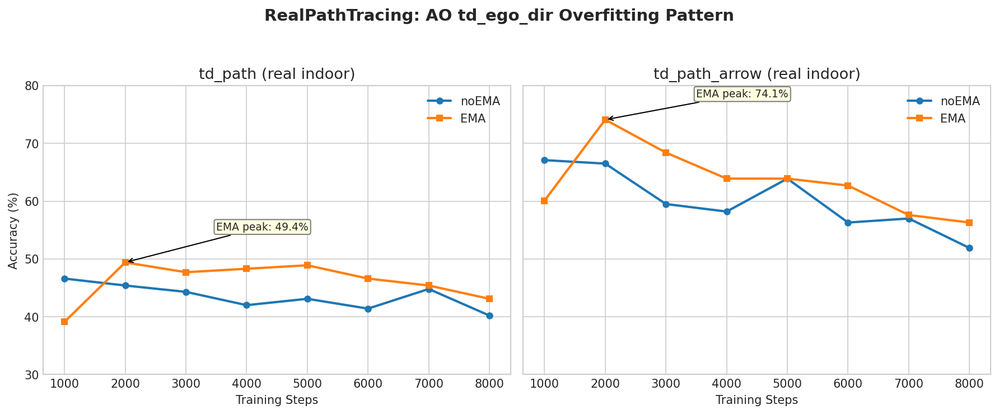

# Evaluation Results — td_ego_dir Training Regime

Back to [Eval Results Index](eval_results.md)

> **Data freshness**: Last updated 2026-03-05. AO complete through s10k. VCoT l32 through s8k. TextCoT think/nothink through s10k (s7k/s9k/s10k PT2PV2 ego_dir pending). MMCoT nothink through s7k (stopped). Mixed VCoT+AO: nothink through s6k, nvcot s4k-s6k cross-subset, answeronly s4k-s6k (more pending s5k-s8k). Mixed from VCoT s7k: s1k nothink. Mixed from VCoT s2k: training ongoing. Baseline available.

## Figures

---

## AO td_ego_dir

Config: `bagel_mot` (text-only, think=True) | Base dir: `.../tifa_v3_td_ego_dir_ao/ao_td_ego_dir_8gpu/`
Training: 5 epochs on td_ego_dir subset. 10k steps completed.

#### EMA

| Subset | s1000 | s2000 | s3000 | s4000 | s5000 | s6000 | s7000 | s8000 | s9000 | s10000 |
|--------|-------|-------|-------|-------|-------|-------|-------|-------|-------|--------|
| PT2P (acc) | 53.8 | 77.5 | 79.0 | 79.0 | 79.3 | **80.9** | 79.6 | 79.9 | 79.0 | 79.6 |
| PT2PV2 ego_dir (acc) | -- | -- | -- | -- | -- | 73.5 | -- | -- | -- | -- |
| PT2PV2 td_path (acc) | -- | -- | -- | -- | -- | 61.5 | -- | -- | -- | -- |
| PT2PV2 td_path_arrow (acc) | -- | -- | -- | -- | -- | 62.0 | -- | -- | -- | -- |
| SV (acc) | 59.6 | 71.2 | 69.2 | 67.7 | 72.7 | 72.2 | 72.2 | 71.7 | **73.7** | **73.7** |
| SV (F1) | 54.5 | 71.1 | 68.7 | 67.3 | 72.5 | 72.2 | 72.1 | 71.6 | 73.7 | **73.7** |
| RealPT path (acc) | 36.2 | **49.4** | 47.7 | 48.3 | 48.9 | 46.6 | 45.4 | 43.1 | -- | -- |
| RealPT arrow (acc) | 57.0 | **74.1** | 68.4 | 63.9 | 63.9 | 62.7 | 57.6 | 56.3 | -- | -- |

#### noEMA

| Subset | s1000 | s2000 | s3000 | s4000 | s5000 | s6000 | s7000 | s8000 | s9000 | s10000 |
|--------|-------|-------|-------|-------|-------|-------|-------|-------|-------|--------|
| PT2P (acc) | 76.3 | 79.0 | 78.1 | 77.5 | 76.9 | 78.1 | 78.4 | 75.1 | 79.3 | **80.2** |
| SV (acc) | 66.7 | 71.2 | 70.7 | 68.2 | 71.7 | 70.2 | 66.2 | 69.7 | 71.7 | 72.2 |
| SV (F1) | 66.5 | 70.9 | 70.3 | 67.7 | 71.6 | 70.0 | 65.4 | 69.7 | 71.7 | 72.2 |
| RealPT path (acc) | **46.6** | 45.4 | 44.3 | 42.0 | 43.1 | 41.4 | 44.8 | 40.2 | -- | -- |
| RealPT arrow (acc) | **67.1** | 66.5 | 59.5 | 58.2 | 63.9 | 56.3 | 57.0 | 51.9 | -- | -- |

> PT2P peaks at **s6k EMA (80.9%)** and **s10k noEMA (80.2%)**. SV peaks at s9k-s10k EMA (73.7%). RealPT peaks early (s1k-s2k) then declines — overfits to AI2Thor synthetic images. td_path_arrow consistently 15-20pp easier than td_path.

---

## VCoT l32 td_ego_dir

Config: `bagel_mot_vcot` (image generation, think=True) | Base dir: `.../tifa_v3_td_ego_dir_vcot_l32/vcot_td_ego_dir_8gpu/`
Training: VCoT with 512x512 output images (latent 32). 8k steps completed.

**Eval settings:**

| Setting | Config | think | understanding_output | vae_input | Image Gen | System Prompt |
|---------|--------|-------|---------------------|-----------|-----------|---------------|
| VCoT (image gen) | `bagel_mot_vcot` | True | False | False (default) | Yes | VCoT think |
| VCoT prefill | `bagel_mot_vcot_prefill` | True | False | False | Yes (prefilled GT) | VCoT think |
| Think (text-only) | `bagel_mot` | True | True | False | No | VCoT think |
| No-think | `bagel_mot_nothink` | False | True | False | No | Answer-only |
| No-think with VAE | `bagel_mot_nothink_vcot` | False | False | False (default) | Yes | Answer-only |
| Answeronly | `bagel_mot_answeronly` | False | True | True | No | Answer-only |

- **`understanding_output=True`**: Text-only generation. Input images encoded via ViT only (no VAE). No image generation loop.
- **`understanding_output=False`**: Enables image generation loop. Input images encoded via both VAE and ViT. If model outputs `<image_start>`, an image will be generated.
- **`vae_input=True`**: Forces VAE input encoding even with `understanding_output=True`. Fixes train-eval mismatch for models trained with `visual_gen=True`.
- **`think=True`**: Uses VCoT system prompt ("think step by step... visual thinking..."). Model may produce `<think>`, `<image_start>`, `<answer>` tags.
- **`think=False`**: Uses answer-only system prompt ("Answer the question"). Model outputs `<answer>` directly.

### VCoT image gen (`bagel_mot_vcot`)

#### EMA

| Subset | s1000 | s2000 | s3000 | s4000 | s5000 | s6000 | s7000 | s8000 |
|--------|-------|-------|-------|-------|-------|-------|-------|-------|
| PT2P (acc) | 51.4 | 52.0 | 60.5 | 61.4 | 58.1 | 58.4 | **64.4** | 61.7 |
| PT2PV2 ego_dir (acc) | -- | -- | -- | -- | -- | -- | 50.4 | -- |
| SV (acc) | 55.6 | 60.6 | 57.1 | 57.1 | 59.1 | **60.1** | **60.1** | 58.1 |
| SV (F1) | 52.8 | 60.5 | 55.5 | 56.1 | 58.3 | **59.5** | 58.8 | 56.9 |
| RealPT path (acc) | -- | -- | -- | 34.5 | -- | -- | 25.3 | -- |
| RealPT arrow (acc) | -- | -- | -- | 36.7 | -- | -- | -- | -- |

#### noEMA

| Subset | s1000 | s2000 | s3000 | s4000 | s5000 | s6000 | s7000 | s8000 |
|--------|-------|-------|-------|-------|-------|-------|-------|-------|
| SV (acc) | **67.2** | 55.1 | 55.1 | 57.1 | 58.1 | 55.6 | 60.6 | 59.1 |
| SV (F1) | **66.3** | 54.5 | 54.1 | 55.5 | 59.2 | 54.2 | 59.4 | 57.9 |

> PT2P peaks at **s7k EMA (64.4%)**. SV peaks at s6k-s7k EMA (~60%). noEMA SV peaks at s1k then drops. Model skews toward predicting 'A'.

### VCoT prefill (`bagel_mot_vcot_prefill`)

GT sideview images injected as visual thoughts — measures reasoning ability independent of image generation quality.

| Subset | Checkpoint | Accuracy | Samples |
|--------|------------|----------|---------|
| PT2P | s3k EMA | **90.9%** | 329 |
| PT2PV2 | s7k EMA | **86.7%** | 113 (partial) |
| AO best (reference) | s6k EMA | 80.9% | 329 |
| VCoT end-to-end (reference) | s3k EMA | 60.5% | 329 |

> The ~30pp gap between prefill (90.9%) and end-to-end VCoT (60.5%) confirms **sideview generation quality is the bottleneck**. Prefill exceeds AO best (80.9%) by ~10pp, showing visual thoughts genuinely help when image quality is high.

### Think text-only (`bagel_mot`)

#### EMA

| Subset | s1000 | s2000 | s3000 |
|--------|-------|-------|-------|
| PT2P (acc) | 55.3 | 68.1 | -- |
| SV (acc) | 57.6 | 66.2 | 68.7 |
| SV (F1) | 51.9 | 65.1 | 68.3 |
| RealPT path (acc) | 30.5 | 0.0 | 0.0 |
| RealPT arrow (acc) | 47.5 | 0.0 | 0.0 |

#### noEMA

| Subset | s1000 | s2000 |
|--------|-------|-------|
| PT2P (acc) | 71.7 | -- |
| SV (acc) | 67.2 | 68.2 |
| SV (F1) | 66.5 | 67.4 |
| RealPT path (acc) | 9.2 | 0.0 |
| RealPT arrow (acc) | 11.4 | 0.0 |

> Text-only think mode: model outputs `<image_start>` and stops producing answers after s1k-s2k. RealPT drops to 0% as model commits to image generation. Partial results only (replaced by nothink eval).

### No-think (`bagel_mot_nothink`)

#### EMA

| Subset | s1000 | s2000 | s3000 | s4000 | s5000 | s6000 | s7000 | s8000 |
|--------|-------|-------|-------|-------|-------|-------|-------|-------|
| PT2P (acc) | 56.5 | **74.5** | 34.7 | -- | -- | -- | 0.0 | -- |
| PT2PV2 ego_dir (acc) | 43.4 | **61.1** | 25.7 | 0.0 | 0.0 | 0.0 | 0.0 | 0.0 |
| PT2PV2 td_path (acc) | -- | 43.2 | -- | -- | -- | -- | -- | -- |
| PT2PV2 td_path_arrow (acc) | -- | 42.7 | -- | -- | -- | -- | -- | -- |
| SV (acc) | 56.6 | **64.6** | 34.3 | -- | -- | -- | 0.0 | -- |
| SV (F1) | 49.5 | **63.4** | 44.3 | -- | -- | -- | 0.0 | -- |
| RealPT path (acc) | 45.4 | **46.6** | 43.1 | 6.9 | -- | -- | -- | -- |
| RealPT arrow (acc) | **65.8** | **68.4** | -- | 3.8 | -- | -- | -- | -- |
| *Cross-subset s2k RealPT:* path=46.6%, arrow=68.4% |

#### noEMA

| Subset | s1000 | s2000 | s3000 |
|--------|-------|-------|-------|
| PT2P (acc) | **72.0** | 71.7 | 0.0 |
| SV (acc) | 67.2 | **68.7** | 0.5 |
| SV (F1) | 66.6 | **69.9** | 1.0 |
| RealPT path (acc) | **47.1** | 46.6 | 0.0 |
| RealPT arrow (acc) | **68.4** | 59.5 | 0.0 |

> **Rise-then-collapse**: Peaks at s2k, collapses by s3k. noEMA collapses completely (0.0%), EMA partially (34.7% PT2P). Same pattern on PT2PV2 and RealPT. VCoT commitment strengthens rapidly between s2k-s3k.

### Answeronly (`bagel_mot_answeronly`)

Text-only generation with VAE input encoding (`vae_input=True`) — matches training setup where input images are encoded via both VAE and ViT.

#### s2k EMA

| Subset | Accuracy |
|--------|----------|
| PT2PV2 td_path | 44.4 |
| PT2PV2 td_path_arrow | 46.8 |
| PT2PV2 td_ego_dir | 15.9 (invalid) |
| RealPT td_path | 51.7 |
| RealPT td_path_arrow | 72.8 |

> PT2PV2 td_ego_dir is **invalid** — 79/113 predictions truncated at `<image_start>`. RealPT td_path_arrow (72.8%) is notably high — exceeds all other models on this subset.

---

## VCoT l32 td_ego_dir — mse_weight variants

Ablation on MSE loss weight. All use same VCoT l32 config, only `--mse_weight` differs.

Base dir: `.../tifa_v3_td_ego_dir_vcot_l32/vcot_td_ego_dir_{mse2,mse5}_8gpu/`

### VCoT mse2 EMA — VCoT image gen (`bagel_mot_vcot`)

| Subset | s1000 |
|--------|-------|
| PT2P (acc) | 47.7 |

### VCoT mse5 EMA — VCoT image gen (`bagel_mot_vcot`)

| Subset | s1000 |
|--------|-------|
| PT2P (acc) | 49.8 |

> Both mse2 and mse5 underperform the default mse1 at s1k (51.4% PT2P). Higher MSE weight slows down the text reasoning improvement early in training. Training stopped at s5k for both variants.

---

## Mixed VCoT+AO td_ego_dir

Config: mixed `bagel_mot_vcot` system prompt for both VCoT and AO samples | Base dir: `.../tifa_v3_td_ego_dir_mixed/mixed_vcot_ao_td_ego_dir_8gpu/`
Training: 50% VCoT (sideview generation) + 50% AO (answer-only with VCoT system prompt). Designed to prevent VCoT commitment collapse. 10k steps, training near completion.

### Think (`bagel_mot`) — EMA

| Subset | s1000 | s2000 | s3000 | s4000 | s5000 |
|--------|-------|-------|-------|-------|-------|
| PT2PV2 (acc) | 45.1 | 61.1 | 69.0 | **70.8** | 69.0 |

### No-think (`bagel_mot_nothink`) — EMA

| Subset | s1000 | s2000 | s3000 | s4000 | s5000 | s6000 |
|--------|-------|-------|-------|-------|-------|-------|
| PT2PV2 ego_dir (acc) | 38.9 | 64.6 | **70.8** | 69.0 | **70.8** | **72.6** |
| PT2PV2 td_path (acc) | 32.0 | 49.7 | 60.4 | 62.1 | 63.3 | **65.1** |
| PT2PV2 td_path_arrow (acc) | 33.9 | 50.9 | 60.2 | **63.2** | 61.4 | 61.4 |
| RealPT td_path (acc) | -- | -- | -- | 43.7 | 44.8 | **45.4** |
| RealPT td_path_arrow (acc) | -- | -- | -- | **68.4** | 62.7 | 59.5 |

### No-think with VAE input (`bagel_mot_nothink_vcot`) — EMA

| Subset | s1000 | s2000 | s3000 | s4000 | s5000 | s6000 |
|--------|-------|-------|-------|-------|-------|-------|
| PT2PV2 ego_dir (acc) | 53.1 | 65.5 | 69.0 | 69.0 | **70.8** | 69.9 |
| PT2PV2 td_path (acc) | -- | -- | -- | 61.5 | 62.1 | **65.1** |
| PT2PV2 td_path_arrow (acc) | -- | -- | -- | 60.8 | -- | 61.4 |
| RealPT td_path (acc) | -- | -- | -- | 42.5 | -- | 42.5 |
| RealPT td_path_arrow (acc) | -- | -- | -- | 62.0 | -- | -- |

### VCoT image gen (`bagel_mot_vcot`) — EMA

| Subset | s1000 | s2000 | s3000 | s4000 | s5000 |
|--------|-------|-------|-------|-------|-------|
| PT2PV2 (acc) | 50.4 | 43.4 | 44.2 | 52.2 | **54.9** |

### Answeronly (`bagel_mot_answeronly`) — EMA

| Subset | s4000 | s5000 | s6000 |
|--------|-------|-------|-------|
| PT2PV2 ego_dir (acc) | 58.4 | -- | **69.9** |
| PT2PV2 td_path (acc) | 59.8 | 62.1 | -- |
| PT2PV2 td_path_arrow (acc) | **63.2** | -- | -- |

> **Key result: Mixed training prevents VCoT collapse.** Think PT2PV2 peaks at **s4k (70.8%)**, nothink ego_dir at **s6k (72.6%)** — no collapse unlike pure VCoT. Nothink td_path peaks at **s6k (65.1%)**, td_path_arrow at **s4k (63.2%)**. RealPT: td_path stable (~44-45%), td_path_arrow peaks at **s4k (68.4%)** then declines (same overfitting pattern). nothink_vcot (VAE input) ego_dir peaks at **s5k (70.8%)**, td_path at **s6k (65.1%)**; RealPT td_path flat at ~42.5%, td_path_arrow strong at s4k (62.0%). Answeronly ego_dir rises to **s6k (69.9%)**, matching nothink_vcot. VCoT image-gen improves to **s5k (54.9%)** after initial dip.

---

## Mixed from VCoT td_ego_dir

Same data mix as Mixed (50% VCoT + 50% AO with VCoT system prompt), but initialized from VCoT l32 checkpoints instead of base BAGEL-7B-MoT. Tests whether starting from a VCoT-pretrained model improves mixed training.

### Mixed from VCoT s7k

Base dir: `.../tifa_v3_td_ego_dir_mixed_from_vcot/mixed_from_vcot_s7k_td_ego_dir_8gpu/`
Initialized from VCoT l32 s7k EMA. 5,000 steps. Training ongoing.

#### No-think (`bagel_mot_nothink`) — EMA

| Subset | s1000 |
|--------|-------|
| PT2PV2 ego_dir (acc) | 19.5 |
| PT2PV2 td_path (acc) | 25.4 |
| PT2PV2 td_path_arrow (acc) | 22.8 |
| RealPT td_path (acc) | 14.4 |
| RealPT td_path_arrow (acc) | 26.6 |

> s1k results are very low — model is still recovering from VCoT s7k initialization (which had fully collapsed to image-gen-only behavior by s7k).

### Mixed from VCoT s2k

Base dir: `.../tifa_v3_td_ego_dir_mixed_from_vcot/mixed_from_vcot_s2k_td_ego_dir_8gpu/`
Initialized from VCoT l32 s2k EMA (best nothink checkpoint before collapse). 5,000 steps. Training started.

*(Evals pending)*

---

## TextCoT td_ego_dir

Config: `bagel_mot` (text-only, think=True) | Base dir: `.../tifa_v3_td_ego_dir_text_cot/textcot_td_ego_dir_8gpu/`
Training: TextCoT with text chain-of-thought reasoning (no image generation). 10k steps completed.

### Think (`bagel_mot`) — EMA

| Subset | s1000 | s2000 | s3000 | s4000 | s5000 | s6000 | s7000 | s8000 | s9000 | s10000 |
|--------|-------|-------|-------|-------|-------|-------|-------|-------|-------|--------|
| PT2P (acc) | 50.8 | 59.6 | 61.1 | 64.4 | **67.8** | 65.7 | 63.2 | 65.7 | 65.0 | 62.9 |
| PT2PV2 ego_dir (acc) | 38.1 | 45.1 | 53.1 | **57.5** | 53.1 | 54.0 | -- | 54.0 | -- | -- |
| PT2PV2 td_path (acc) | -- | -- | -- | 45.0 | 47.9 | -- | -- | -- | -- | 46.2 |
| PT2PV2 td_path_arrow (acc) | -- | -- | -- | 48.0 | 48.0 | -- | -- | -- | -- | 43.9 |
| SV (acc) | 52.0 | 56.6 | 58.6 | 62.6 | **64.6** | 63.1 | **64.6** | 62.1 | 61.1 | 60.1 |
| SV (F1) | 21.5 | 41.1 | 48.1 | 54.3 | 58.8 | 57.3 | **60.2** | 58.6 | 59.1 | 61.8 |
| RealPT td_path (acc) | -- | -- | -- | **55.2** | 52.3 | -- | -- | -- | -- | 44.3 |
| RealPT td_path_arrow (acc) | -- | -- | -- | **61.4** | 51.3 | -- | -- | -- | -- | 46.8 |

### No-think (`bagel_mot_nothink`) — EMA

| Subset | s1000 | s2000 | s3000 | s4000 | s5000 | s6000 | s7000 | s8000 | s9000 | s10000 |
|--------|-------|-------|-------|-------|-------|-------|-------|-------|-------|--------|
| PT2P (acc) | 47.7 | 56.5 | 59.9 | 63.5 | 64.7 | 63.2 | 63.5 | 65.3 | -- | **66.0** |
| PT2PV2 ego_dir (acc) | 38.9 | 41.6 | 47.8 | 46.0 | **55.8** | 47.8 | -- | 50.4 | -- | -- |
| PT2PV2 td_path (acc) | -- | -- | -- | -- | 42.6 | -- | -- | -- | -- | -- |
| PT2PV2 td_path_arrow (acc) | -- | -- | -- | -- | 49.7 | -- | -- | -- | -- | -- |
| SV (acc) | 51.5 | 55.1 | 64.1 | 63.6 | 63.6 | **64.1** | **64.1** | 61.6 | 62.6 | 62.1 |
| SV (F1) | 20.0 | 38.6 | 53.0 | 53.8 | 52.0 | 55.9 | **57.5** | 53.1 | 55.8 | 58.8 |
| RealPT td_path (acc) | -- | -- | -- | -- | 50.6 | -- | -- | -- | -- | -- |
| RealPT td_path_arrow (acc) | -- | -- | -- | -- | 53.8 | -- | -- | -- | -- | -- |

> PT2P peaks at **s5k (67.8% think)**, then declines through s10k (62.9%). Nothink PT2P keeps improving to **s10k (66.0%)**. PT2PV2 peaks at **s4k (57.5% think)**. SV peaks at **s5k-s7k (~64.6% think)**. Cross-subset think: RealPT peaks at **s4k** (td_path=55.2%, td_path_arrow=61.4%), declining to 44.3%/46.8% by s10k — same overfitting pattern as AO. PT2PV2 td_path stable (~45-48%) across s4k-s10k.

---

## MMCoT td_ego_dir

Config: `bagel_mot_vcot` (image generation, think=True) | Base dir: `.../tifa_v3_td_ego_dir_mmcot/mmcot_td_ego_dir_8gpu/`
Training: Multimodal CoT with sideview generation + text reasoning. Latent 32 (512x512 output). Stopped at s7k (7,700 steps).

### No-think (`bagel_mot_nothink`) — EMA

| Subset | s1000 | s2000 | s3000 | s4000 | s5000 | s6000 | s7000 |
|--------|-------|-------|-------|-------|-------|-------|-------|
| PT2P (acc) | 48.0 | 63.2 | 66.0 | 69.6 | 68.7 | **71.4** | 69.6 |
| PT2PV2 ego_dir (acc) | 33.6 | 39.8 | 52.2 | 59.3 | **62.8** | 59.3 | 59.3 |
| PT2PV2 td_path (acc) | -- | -- | -- | -- | 34.9 | -- | -- |
| PT2PV2 td_path_arrow (acc) | -- | -- | -- | -- | 36.3 | -- | -- |
| SV (acc) | 52.0 | 60.1 | 66.2 | 68.7 | **70.2** | 67.2 | 66.7 |
| SV (F1) | 20.2 | 43.2 | 55.0 | 59.2 | **63.4** | 59.6 | 58.8 |
| RealPT td_path (acc) | -- | -- | -- | -- | 44.3 | -- | -- |
| RealPT td_path_arrow (acc) | -- | -- | -- | -- | 57.6 | -- | -- |

> MMCoT nothink improves steadily. PT2P peaks at **s6k (71.4%)**, approaching AO levels (80.9%). SV peaks at **s5k (70.2%/F1=63.4)**, then declines. PT2PV2 ego_dir peaks at **s5k (62.8%)**. Cross-subset at s5k: td_path (34.9%) and td_path_arrow (36.3%) much weaker than ego_dir — 25-28pp gap. RealPT decent (44.3/57.6%). Training stopped — past peak.

---

## Baseline (BAGEL-7B-MoT)

Config: `bagel_mot` (text-only, think=True) | Model: base BAGEL-7B-MoT (no fine-tuning)

| Subset | Accuracy |
|--------|----------|
| PT2PV2 td_path | 26.0 |
| PT2PV2 td_path_arrow | 27.5 |
| PT2PV2 td_ego_dir | 36.3 |
| PT2P td_path SV | 42.5 |
| RealPT td_path | 39.7 |
| RealPT td_path_arrow | 45.6 |

> PT2PV2 td_ego_dir (36.3%) significantly higher than td_path (26.0%) at baseline — ego_dir is an easier task format. td_path and td_path_arrow nearly identical (26.0% vs 27.5%). RealPT arrow (45.6%) easier than path (39.7%).

