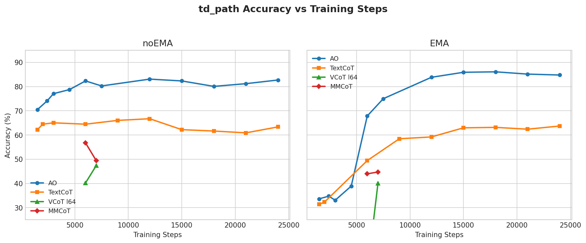
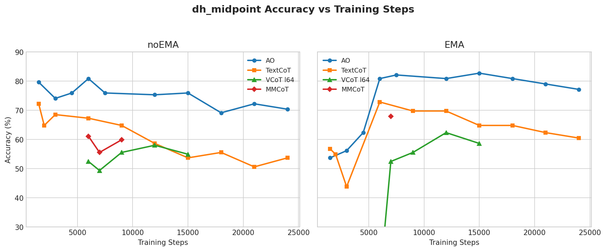
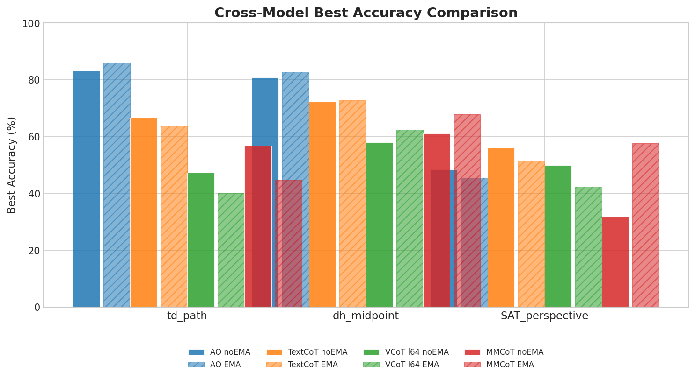
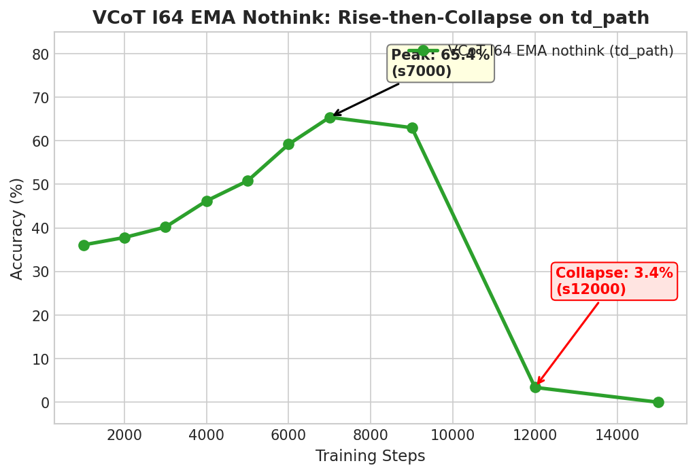

# Evaluation Results — td_path Training Regime

Back to [Eval Results Index](eval_results.md)

> **Data freshness**: Last updated 2026-03-03. Markers: **+** = answer extraction rate <90% (EMA not converged). VCoT l64 and MMCoT training still running; results beyond s15000/s9000 respectively pending. VCoT l64 td_path/td_path_arrow evals at s9000-s15000 were cancelled to free GPUs — only dh_midpoint and SAT_perspective available at those steps. MMCoT s12000/s15000 evals incomplete (partial pkl files only).

## Figures

---

## Answer-Only (AO)

Config: `bagel_mot` | Base dir: `.../tifa_v3_td_path_answer_only/ao_td_path_8gpu/`
Steps/epoch: 242 | s1200 = 5ep, s2400 = 10ep
Training extended to 25k steps (save_every=3000 from s7500 onward).

### AO noEMA -- Early Training

| Subset | s1500 | s2400 | s3000 | s4500 | s6000 | s7500 |
|--------|-------|-------|-------|-------|-------|-------|
| td_path | 70.49 | 74.06 | 77.07 | 78.76 | 82.33 | 80.26 |
| td_path_arrow | 70.02 | 74.07 | 76.90 | 77.60 | 79.01 | 79.01 |
| dh_midpoint | 79.63 | 74.69 | 74.07 | 75.93 | 80.86 | 75.93 |
| td_midpoint | 72.73 | -- | 73.14 | 75.62 | 75.21 | 74.79 |
| td_ego_dir | 69.00 | -- | 69.91 | 73.56 | 74.16 | 68.69 |
| td_ego_side | 67.65 | -- | 78.27 | 79.75 | 80.74 | 78.52 |
| td_ego_dir_arrow | 67.06 | -- | 69.14 | 71.22 | 73.59 | 66.47 |
| td_ego_side_arrow | 66.76 | -- | 78.21 | 77.37 | 78.21 | 76.82 |
| PathTracing | 68.46 | -- | 70.42 | 82.15 | 84.11 | 84.35 |
| Perspective_Arrow | 52.28 | -- | 54.25 | 54.72 | 53.51 | 53.82 |
| Perspective_NoArrow | 53.13 | -- | 53.40 | 53.76 | 51.41 | 53.20 |
| SAT_perspective | -- | -- | -- | -- | 40.91 | -- |

### AO EMA -- Early Training

| Subset | s1500 | s2400 | s3000 | s4500 | s6000 | s7500 |
|--------|-------|-------|-------|-------|-------|-------|
| td_path | 33.65+ | 34.77+ | 33.08+ | 38.91 | 67.86 | 75.00 |
| td_path_arrow | 35.10+ | 37.92+ | 35.45+ | 45.68 | 70.02 | 76.90 |
| dh_midpoint | 53.70+ | 55.56+ | 56.17+ | 62.35 | 80.86 | 82.10 |
| td_midpoint | 48.76+ | -- | 52.48+ | 56.61 | 74.79 | 78.93 |
| td_ego_dir | 44.68 | -- | 45.59 | 55.93 | 66.87 | 71.43 |
| td_ego_side | 41.73 | -- | 54.07 | 60.99 | 69.88 | 75.06 |
| td_ego_dir_arrow | 47.18 | -- | 52.23 | 61.13 | 67.66 | 71.81 |
| td_ego_side_arrow | 48.60 | -- | 59.22 | 67.32 | 72.91 | 78.49 |
| PathTracing | 27.38+ | -- | 32.76+ | 47.92 | 65.53 | 73.11 |
| Perspective_Arrow | 36.05+ | -- | 40.18+ | 41.61+ | 52.23 | 54.78 |
| Perspective_NoArrow | -- | -- | 39.66+ | 44.79+ | 50.54 | 51.00 |

+Answer extraction rate <90%.

### AO noEMA -- Extended Training (s12k-s24k)

| Subset | s12000 | s15000 | s18000 | s21000 | s24000 |
|--------|--------|--------|--------|--------|--------|
| td_path | 83.08 | 82.33 | 80.08 | 81.20 | 82.71 |
| td_path_arrow | 83.25 | 82.19 | 80.07 | 79.01 | 82.36 |
| dh_midpoint | 75.31 | 75.93 | 69.14 | 72.22 | 70.37 |
| Perspective_Arrow | -- | 51.21 | -- | 55.84 | 54.07 |
| Perspective_NoArrow | -- | 50.76 | -- | 56.22 | 53.72 |
| SAT_perspective | 39.39 | 37.88 | 46.97 | 43.94 | 48.48 |

> Missing Perspective results at s12000/s18000: those eval jobs failed in the port-collision batch and need resubmission.

### AO EMA -- Extended Training (s12k-s24k)

| Subset | s12000 | s15000 | s18000 | s21000 | s24000 |
|--------|--------|--------|--------|--------|--------|
| td_path | 83.83 | 85.90 | **86.09** | 85.15 | 84.77 |
| td_path_arrow | 83.95 | 84.66 | 85.19 | 84.66 | **85.36** |
| dh_midpoint | 80.86 | **82.72** | 80.86 | 79.01 | 77.16 |
| Perspective_Arrow | 54.77 | 54.65 | 53.40 | 54.07 | 53.34 |
| Perspective_NoArrow | 53.57 | **54.14** | **54.66** | 52.89 | 53.07 |
| SAT_perspective | 39.39 | 39.39 | 40.91 | **45.45** | 42.42 |

**AO key findings**: EMA consistently outperforms noEMA by 3-6pp on core subsets. EMA peaks at s18000 for td_path (86.09%) and s15000 for dh_midpoint (82.72%). Performance plateaus after s15000 with slight degradation on dh_midpoint. SAT_perspective steadily improves with training (22.73% baseline -> 48.48% at s24000 noEMA).

---

## Text-CoT

Config: `bagel_mot` | Base dir: `.../tifa_v3_td_path_text_cot/textcot_td_path_8gpu/`
Steps/epoch: 242 | s1200 = 5ep, s2400 = 10ep
Training extended to 25k steps (save_every=3000 from s3000 onward).

### TextCoT noEMA -- Early Training

| Subset | s1500 | s2000 |
|--------|-------|-------|
| td_path | 62.22 | 64.47 |
| td_path_arrow | 63.67 | 61.20 |
| dh_midpoint | 72.22 | 64.81 |
| td_midpoint | 67.36 | 62.40 |
| td_ego_dir | 53.80 | 55.62 |
| td_ego_side | 68.89 | 69.38 |
| td_ego_dir_arrow | 51.34 | 56.97 |
| td_ego_side_arrow | 67.88 | 65.08 |
| PathTracing | 68.22 | 70.42 |
| Perspective_Arrow | 47.75 | 47.67 |
| Perspective_NoArrow | 48.83 | 50.12 |
| SAT_perspective | 59.09 | -- |

### TextCoT EMA -- Early Training

| Subset | s1500 | s2000 |
|--------|-------|-------|
| td_path | 31.39+ | 32.33+ |
| td_path_arrow | 33.33+ | 35.27+ |
| dh_midpoint | 56.79+ | 54.94+ |
| td_midpoint | 47.11+ | FAIL |
| td_ego_dir | 45.90 | 46.81 |
| td_ego_side | 44.94 | 43.70 |
| td_ego_dir_arrow | 48.66 | 47.77 |
| td_ego_side_arrow | 50.84 | 48.88 |
| PathTracing | 33.01+ | 31.54+ |
| Perspective_Arrow | -- | 31.04+ |
| Perspective_NoArrow | -- | 41.65+ |

+Answer extraction rate <90%.

### TextCoT noEMA -- Extended Training (s3k-s24k)

| Subset | s3000 | s6000 | s9000 | s12000 | s15000 | s18000 | s21000 | s24000 |
|--------|-------|-------|-------|--------|--------|--------|--------|--------|
| td_path | 65.04 | 64.47 | 66.04 | **66.73** | 62.22 | 61.65 | 60.90 | 63.35 |
| td_path_arrow | 61.55 | **65.60** | 60.84 | 63.49 | 59.06 | 64.60 | 62.84 | 59.26 |
| dh_midpoint | **68.52** | 67.28 | 64.81 | 58.64 | 53.70 | 55.56 | 50.62 | 53.70 |
| Perspective_Arrow | 52.51 | 51.80 | 47.14 | 49.28 | 45.71 | 49.28 | 43.93 | 50.00 |
| Perspective_NoArrow | **53.57** | 52.15 | 51.79 | 52.86 | 48.93 | 48.21 | 41.43 | 45.36 |
| SAT_perspective | -- | **56.06** | 39.39 | 34.85 | 50.00 | 45.45 | -- | -- |

### TextCoT EMA -- Extended Training (s3k-s24k)

| Subset | s3000 | s6000 | s9000 | s12000 | s15000 | s18000 | s21000 | s24000 |
|--------|-------|-------|-------|--------|--------|--------|--------|--------|
| td_path | 32.01+ | 49.44 | 58.46 | 59.21 | 62.97 | 63.16 | 62.41 | **63.72** |
| td_path_arrow | 30.51+ | 44.07 | 57.53 | 59.25 | 60.84 | 63.49 | 59.26 | **61.73** |
| dh_midpoint | 43.83 | **72.84** | 69.75 | 69.75 | 64.81 | 64.81 | 62.35 | 60.49 |
| Perspective_Arrow | -- | **55.00** | **55.00** | 52.15 | 54.00 | 54.64 | 51.79 | **56.47** |
| Perspective_NoArrow | -- | **58.33** | 52.15 | 49.64 | 49.29 | 54.29 | 50.00 | 49.64 |
| SAT_perspective | -- | 50.00 | 50.00 | **51.52** | 48.48 | 40.91 | -- | -- |

+Answer extraction rate <90% (EMA not converged at s3000).

**TextCoT key findings**: noEMA peaks early (s3000-s12000) then degrades on dh_midpoint (68.5% → 50.6%), but partially recovers on td_path at s24000 (63.4%). EMA lags noEMA by ~6000 steps and continues improving through s24000, where it achieves best td_path (63.7%) — slightly above noEMA at the same step. At s24000 noEMA and EMA nearly converge on td_path (~63%). EMA dh_midpoint peaks at s6000 (72.8%) then steadily declines. Overall, TextCoT significantly underperforms AO on td_path (~64% vs ~86%).

---

## VCoT l64

Config: `bagel_mot_vcot` | Base dir: `.../tifa_v3_td_path_cot_l64/`
Steps/epoch: 606 | s3000 = 5ep, s6000 = 10ep
Training extended to 25k steps (still running).

### VCoT l64 noEMA

| Subset | s6000 | s7000 | s9000 | s12000 | s15000 |
|--------|-------|-------|-------|--------|--------|
| td_path | 40.23 | **47.37** | -- | -- | -- |
| td_path_arrow | 38.45 | **45.15** | -- | -- | -- |
| dh_midpoint | 52.47 | 49.38 | 55.56 | **58.02** | 54.94 |
| SAT_perspective | -- | -- | **46.97** | 19.70 | **50.00** |

### VCoT l64 EMA

| Subset | s6000 | s7000 | s9000 | s12000 | s15000 |
|--------|-------|-------|-------|--------|--------|
| td_path | 3.01+! | **40.04** | -- | -- | -- |
| td_path_arrow | 2.47+! | **41.80** | -- | -- | -- |
| dh_midpoint | 11.11+! | 52.47 | 55.56 | **62.35** | 58.64 |
| SAT_perspective | -- | -- | 37.88 | **42.42** | 39.39 |

+! EMA has not converged at s6000 (5-25% answer extraction).

> td_path, td_path_arrow, Perspective_Arrow, Perspective_NoArrow results missing for s9000-s15000: evals were cancelled to free up GPU resources. Will be resubmitted later.

### VCoT l64 — Text-only think (`bagel_mot`)

Text-only eval of VCoT checkpoints using `bagel_mot` config (think=True, understanding_output=True).
The model generates `<think>desc</think><image_start>` but no image is produced — answer extraction fails.

| Subset | s7000 EMA | s7000 noEMA | s9000 EMA | s9000 noEMA |
|--------|-----------|-------------|-----------|-------------|
| td_path | 0.0 | 0.8 | 0.0 | 0.2 |

> All ~0%: VCoT l64 model always outputs `<think>desc</think><image_start>` in text-only mode, never producing an answer letter in text-only mode. The model has completely lost text-only answering ability.

### VCoT l64 — No-think (`bagel_mot_nothink`)

Text-only eval with answer-only system prompt + "Do not think or generate any images." appended to question.

**EMA** — shows clear rise-then-collapse pattern:

| Subset | s1000 | s2000 | s3000 | s4000 | s5000 | s6000 | s7000 | s9000 | s12000 | s15000 |
|--------|-------|-------|-------|-------|-------|-------|-------|-------|--------|--------|
| td_path | 36.1 | 37.8 | 40.2 | 46.2 | 50.8 | 59.2 | **65.4** | 63.0 | 3.4 | 0.0 |

**noEMA** — all near 0% (s1k-s6k not converted):

| Subset | s7000 | s9000 | s12000 | s15000 |
|--------|-------|-------|--------|--------|
| td_path | 0.4 | 5.1 | 2.1 | 0.4 |

> **Key finding**: EMA nothink accuracy rises steadily from s1k (36.1%) to s7k (65.4%), then collapses at s12k (3.4%) and s15k (0.0%). This suggests VCoT training progressively strengthens image generation commitment, and by s12k the model can no longer suppress it even with explicit "do not generate" instruction. noEMA never learns to suppress image generation.

### VCoT dh_midpoint debug (vcot_debug_8gpu)

| Subset | s1000 noEMA | s2000 noEMA | s1000 full | s2000 EMA |
|--------|-------------|-------------|------------|-----------|
| dh_midpoint | 62.96 | **67.28** | 52.47+ | 46.91+ |

+Answer extraction rate <90%.

---

## MMCoT

Config: `bagel_mot_vcot` | Base dir: `.../tifa_v3_td_path_mmcot/mmcot_td_path_8gpu/`
Steps/epoch: 606 | s3000 = 5ep, s6000 = 10ep
Training extended to 25k steps (still running).

### MMCoT noEMA

| Subset | s6000 | s7000 | s9000 |
|--------|-------|-------|-------|
| td_path | **56.77** | 49.44 | -- |
| td_path_arrow | 51.50 | **51.15** | -- |
| dh_midpoint | 61.11 | 55.56 | **59.88** |
| SAT_perspective | -- | -- | 31.82 |

### MMCoT EMA

| Subset | s6000 | s7000 | s9000 |
|--------|-------|-------|-------|
| td_path | 43.98 | **44.74** | -- |
| td_path_arrow | 41.80 | **46.38** | -- |
| dh_midpoint | -- | **67.90** | -- |
| SAT_perspective | **57.58** | -- | 36.36 |

> td_path, td_path_arrow, Perspective results missing for s9000+: evals were cancelled. s12000/s15000 not yet evaluated.

---

## Cross-Model Comparison: Path Tracing (td_path)

| Model | Best noEMA | Best EMA |
|-------|-----------|----------|
| AO | 83.08 (s12000) | **86.09** (s18000) |
| TextCoT | 66.73 (s12000) | 63.72 (s24000) |
| MMCoT | 56.77 (s6000) | 44.74 (s7000) |
| VCoT l64 | 47.37 (s7000) | 40.04 (s7000) |

## Cross-Model Comparison: DH Midpoint

| Model | Best noEMA | Best EMA |
|-------|-----------|----------|
| AO | 80.86 (s6000) | **82.72** (s15000) |
| TextCoT | 72.22 (s1500) | 72.84 (s6000) |
| VCoT l64 debug | 67.28 (s2000) | -- |
| VCoT l64 | 58.02 (s12000) | 62.35 (s12000) |
| MMCoT | 61.11 (s6000) | 67.90 (s7000) |

## Cross-Model Comparison: Perspective Taking

### AI2Thor Perspective (Arrow) -- category-averaged

| Model | Best noEMA | Best EMA |
|-------|-----------|----------|
| AO | 55.84 (s21000) | **54.78** (s7500) |
| TextCoT | 52.51 (s3000) | 56.47 (s24000) |

### AI2Thor Perspective (NoArrow) -- category-averaged

| Model | Best noEMA | Best EMA |
|-------|-----------|----------|
| AO | 56.22 (s21000) | 54.66 (s18000) |
| TextCoT | 53.57 (s3000) | **58.33** (s6000) |

### SAT Perspective

| Model | Checkpoint | Accuracy (%) |
|-------|-----------|-------------|
| Baseline | -- | 22.73 |
| TextCoT | s6000 noEMA | **56.06** |
| TextCoT | s1500 noEMA | 59.09 |
| MMCoT | s6000 EMA | 57.58 |
| VCoT l64 | s15000 noEMA | 50.00 |
| AO | s24000 noEMA | 48.48 |

---

## Visualization HTMLs

Generated by `scripts/visualize_eval.py`.

| File | Model | Contents |
|------|-------|----------|
| `.../bagel_eval/textcot_s2000_noema_td_path_viz.html` | TextCoT s2000 noEMA | 50 samples, td_path (48 MB) |
| `.../bagel_eval/ao_s6000_noema_td_path_viz.html` | AO s6000 noEMA | 50 samples, td_path (48 MB) |
| `.../bagel_eval/vcot_l64_s7000_noema_dh_midpoint_viz.html` | VCoT l64 s7000 noEMA | 50 samples, dh_midpoint (31 MB) |
| `.../bagel_eval/mmcot_s7000_ema_dh_midpoint_viz.html` | MMCoT s7000 EMA | 50 samples, dh_midpoint (35 MB) |
| `.../bagel_eval/ao_s6000_noema_perspective_arrow_viz.html` | AO s6000 noEMA | 50 samples, Perspective Arrow (55 MB) |
| `.../bagel_eval/ao_s6000_noema_perspective_noarrow_viz.html` | AO s6000 noEMA | 50 samples, Perspective NoArrow (55 MB) |
| `.../bagel_eval/textcot_s1500_noema_perspective_arrow_viz.html` | TextCoT s1500 noEMA | 50 samples, Perspective Arrow (55 MB) |
| `.../bagel_eval/textcot_s1500_noema_perspective_noarrow_viz.html` | TextCoT s1500 noEMA | 50 samples, Perspective NoArrow (55 MB) |
